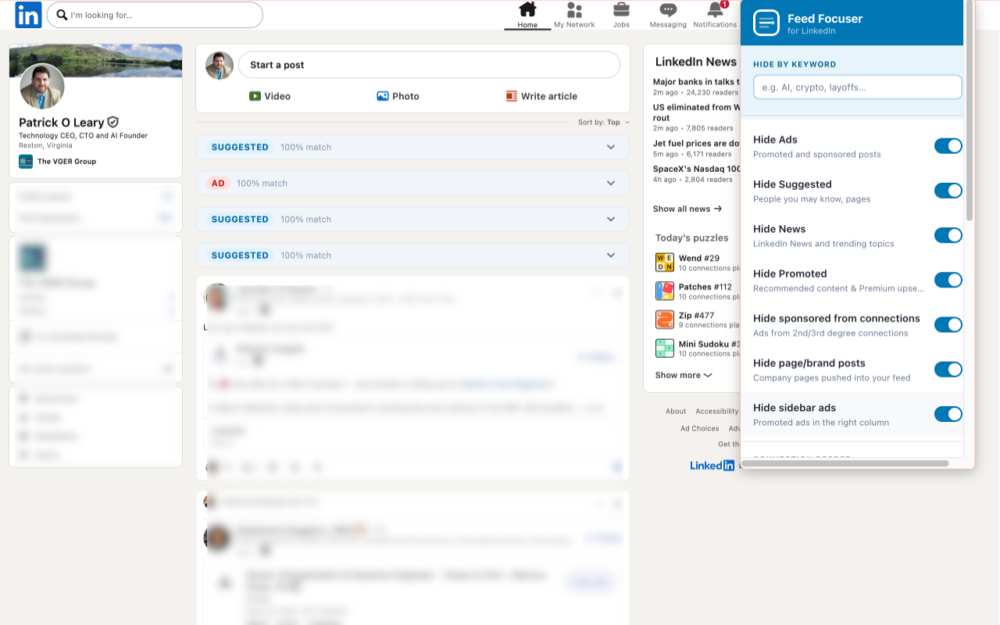
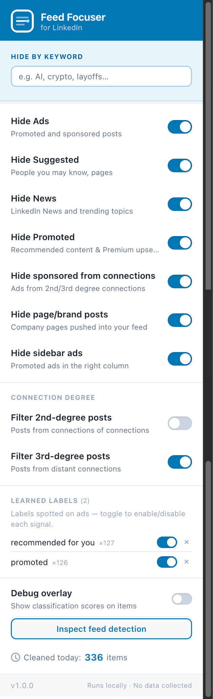

# Feed Focuser

A browser extension that cleans up your professional network feed — collapsing or hiding ads, sponsored posts, "Recommended for you" suggestions, and other noise so you can focus on posts from people you actually follow.

**Runs entirely in your browser. No data is collected or sent anywhere.**

Read the [announcement post](https://thevgergroup.com/vger-for-good/feed-focuser/) on The Vger Group blog.

> Unofficial third-party tool. Not affiliated with or endorsed by LinkedIn Corporation.

---

## Install

### Chrome / Edge / Brave

1. Go to the [Releases](https://github.com/thevgergroup/feed_focuser/releases) page and download `feed-focuser-chrome.zip`
2. Unzip it anywhere on your computer
3. Open Chrome and go to `chrome://extensions`
4. Turn on **Developer mode** (top-right toggle)
5. Click **Load unpacked** and select the unzipped `extension` folder
6. Navigate to [linkedin.com/feed](https://www.linkedin.com/feed) — the extension starts immediately

### Firefox

1. Go to the [Releases](https://github.com/thevgergroup/feed_focuser/releases) page and download `feed-focuser-firefox.xpi`
2. Open Firefox and go to `about:addons`
3. Click the gear icon → **Install Add-on From File…**
4. Select the downloaded `.xpi` file

> **Note:** Firefox requires the extension to be signed for permanent installation. For temporary use, go to `about:debugging` → **This Firefox** → **Load Temporary Add-on** and select the `.xpi` file.

---

## What it does

When you open your feed, Feed Focuser collapses filtered posts into a slim strip showing what was caught and why. Click the arrow on any strip to expand and read the post.

| Strip colour | What was caught |
|---|---|
| 🔴 **Ad** | Promoted or sponsored posts |
| 🔵 **Suggested** | "Recommended for you", "People you may know" |
| 🟡 **News** | LinkedIn News and trending topics |
| 🟣 **Brand post** | Company pages pushed into your feed |
| 🟠 **Reshare** | "X likes/celebrates this" posts below your engagement threshold |
| 🟢 **Keyword match** | Posts containing your custom keywords |

Each strip has an **Always show** button — click it to restore that card immediately without opening the popup.

You can switch from collapsed strips to complete hiding in the extension popup.

---

## Settings

Click the Feed Focuser icon in your browser toolbar to open the popup.

**Hide by keyword** — type a word and press Enter to hide any post containing that text. Great for filtering out topics like "AI", "crypto", or "layoffs" when your feed gets overrun.

**Filter toggles** — turn individual categories on or off (Ads, Suggested, News, Promoted, company page posts, sidebar ads, etc.)

**Filter low-engagement reshares** — collapses "X likes/celebrates this" posts whose total engagement (reactions + comments + reposts) is below a configurable threshold (default: 10). High-engagement reshares pass through.

**Connection degree** — choose whether posts from 2nd or 3rd-degree connections are treated as organic or filtered.

**Always sort by Recent** — prevents LinkedIn from resetting your feed sort to "Top" on every page load.

**Collapse / hide** — "Collapse filtered posts" (on by default) shows filtered items as slim strips with an **Always show** button for one-click restore. Turn it off to hide completely.

**Learned labels** — as you scroll, Feed Focuser learns the exact label text your region and language uses for ads (e.g. "Promoted · Partnership with X", "Patrocinado"). Once a label appears on 3+ ad cards it shows up here so you can toggle it on or off.

 

---

## Privacy

- All processing happens locally in your browser
- No analytics, no tracking, no external requests
- Settings are stored in your browser's built-in extension storage
- Nothing leaves your machine

---

## License

MIT — see [LICENSE](LICENSE)

---

*For build instructions and developer setup, see [DEV.md](DEV.md).*
